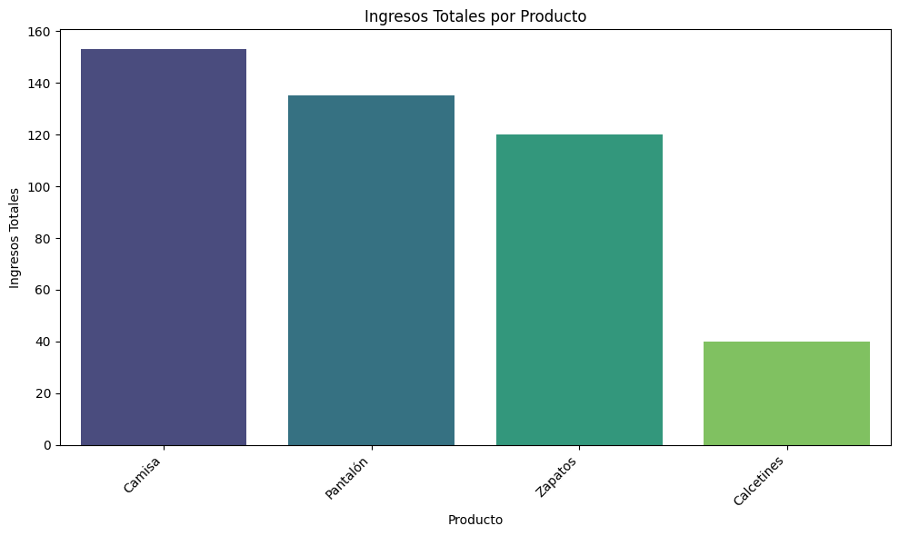

# Análisis de Datos de Ventas con Python: Proyecto de Ejemplo

## Descripción del Proyecto

En este proyecto, llevé a cabo un análisis de datos para demostrar las etapas clave de un flujo de trabajo de análisis utilizando Python y Google Colab. El objetivo principal fue explorar un conjunto de datos de ventas simplificado y extraer conclusiones útiles que puedan apoyar decisiones de negocio.

## Dataset Utilizado

Trabajé con un dataset ficticio y simplificado que creé directamente en el cuaderno de Python. Aunque pequeño, incluye información relevante como ID de transacción, productos, cantidades, precios, fechas, países y métodos de pago, lo que permitió aplicar diversas técnicas de análisis.

## Herramientas y Librerías

- Python: Lenguaje de programación principal.

- Pandas: Para manipulación y análisis de datos.

- Matplotlib: Para visualización de datos.

- Seaborn: Para visualización de datos estadísticos.

- Google Colab: Entorno de desarrollo interactivo basado en la nube. (https://colab.research.google.com/drive/15NwYATLWj5rmfaH276UHzg7VIa14xEFm?usp=sharing)

## Fases del Análisis y Conclusiones Clave

El análisis siguió estos pasos:

- Configuración del Entorno: Preparé el entorno de Google Colab e importé las librerías necesarias.

- Creación del Dataset: Generé un DataFrame de Pandas con datos de ventas de ejemplo.

- Exploración Inicial de Datos (EDA):

- Revisé la estructura del DataFrame con .info().

- Obtuve estadísticas descriptivas de las columnas numéricas con .describe().

- Identifiqué la necesidad de convertir la columna Fecha_Venta al formato datetime.

## Limpieza y Preprocesamiento de Datos:

- Convertí Fecha_Venta a tipo datetime.

- Creé una nueva columna Total_Venta (Cantidad * Precio_Unitario) para facilitar el análisis de ingresos.

## Análisis y Visualización de Datos (Preguntas de Negocio): Respondí varias preguntas clave:

- Productos más Rentables: Identifiqué que "Camisa", "Pantalón" y "Zapatos" generaron la mayor parte de los ingresos en este dataset.

- Países con Mayores Ingresos: España destacó como el país con la mayor contribución a los ingresos totales.

- Métodos de Pago Preferidos: La tarjeta fue el método de pago más frecuente.

- Valor Promedio de la Transacción: Calculé que el valor promedio de una transacción fue de €56.00.

## Conclusiones

Este proyecto muestra cómo transformar datos brutos en conclusiones útiles. Aunque utilicé un dataset pequeño y simplificado, el proceso permitió identificar tendencias de ventas, preferencias de clientes y rendimiento por producto o geografía, elementos clave para tomar decisiones basadas en datos.

