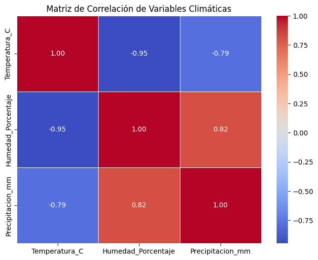

# Mi Proyecto de Análisis de Datos Climáticos y Tendencias de Temperatura

## Descripción General del Proyecto

En este proyecto, me he sumergido en el análisis de datos de series de tiempo, aplicando mis conocimientos de Python para explorar un conjunto de datos climáticos. Mi objetivo principal fue realizar un análisis exploratorio de datos para comprender el comportamiento de las temperaturas y la precipitación a lo largo del tiempo, buscando identificar tendencias, patrones y posibles relaciones entre las variables climáticas.

## El Dataset que Utilicé

Para este análisis, creé un dataset de ejemplo directamente en Python. Decidí simular temperaturas diarias, humedad y precipitación durante un mes para una ciudad ficticia. Esta aproximación me permitió concentrarme en las técnicas de análisis sin la complejidad adicional de la carga de archivos externos, asegurando que los datos estuvieran listos para el análisis de series de tiempo desde el principio.

## Herramientas y Librerías que Empleé

Para llevar a cabo este proyecto, utilicé Python como mi lenguaje principal de programación. Las librerías que empleé incluyeron Pandas para la manipulación y el análisis de datos estructurados en DataFrames, Matplotlib para la creación de visualizaciones básicas como gráficos de líneas y barras, y Seaborn para generar visualizaciones estadísticas más atractivas, como los mapas de calor para la correlación. Mi entorno de trabajo principal fue Google Colab, que me proporcionó un espacio interactivo y accesible en la nube.

## Mi Proceso de Análisis y Descubrimientos

Mi enfoque se dividió en varias fases clave para lograr los objetivos del proyecto. Inicialmente, creé el dataset de ejemplo, asegurándome de que la columna de 'Fecha' fuera de tipo datetime y la establecí como el índice del DataFrame, lo cual es fundamental para el análisis de series de tiempo.

Posteriormente, realicé una exploración inicial de datos. Utilicé `df.info()` para verificar los tipos de datos y confirmar la ausencia de valores nulos, lo que me indicó que mi dataset estaba completo. Con `df.describe()`, obtuve un resumen estadístico de las variables numéricas, lo que me permitió entender los rangos y promedios de temperatura, humedad y precipitación en mi conjunto de datos simulado. También confirmé que el índice de fecha era un `DatetimeIndex`, crucial para el análisis temporal.

Una vez que los datos estaban preparados, procedí a la visualización de las series de tiempo. Grafiqué la 'Temperatura_C' a lo largo del mes, lo que me permitió observar fluctuaciones diarias y una tendencia general con picos y valles claros. Asimismo, visualicé la 'Precipitacion_mm' en un gráfico de barras, identificando dos períodos distintos con lluvias significativas durante el mes simulado.

Finalmente, para entender las relaciones entre las variables climáticas, calculé la matriz de correlación y la visualicé con un mapa de calor. A través de este análisis, descubrí una fuerte correlación negativa entre la temperatura y la humedad (-0.95), sugiriendo que los días más cálidos tendían a ser menos húmedos. También observé una fuerte correlación negativa entre la temperatura y la precipitación (-0.79) y una fuerte correlación positiva entre la humedad y la precipitación (0.82), resultados que son lógicamente consistentes con los fenómenos meteorológicos.

## Mis Conclusiones

Este proyecto me permitió reforzar mis habilidades en el manejo y análisis de datos de series de tiempo utilizando Python. Pude extraer información significativa sobre las tendencias de temperatura, los patrones de lluvia y, crucialmente, las interrelaciones entre diferentes variables climáticas. Entender estas correlaciones es un componente fundamental para cualquier tipo de modelado o predicción climática futura, lo que demuestra la capacidad de transformar datos brutos en información accionable.

---

[Enlace a mi Cuaderno de Colab en GitHub](https://colab.research.google.com/drive/1Wonu3cq6YHOQfelZn8e5NREuy8jrJzfR?usp=sharing)
